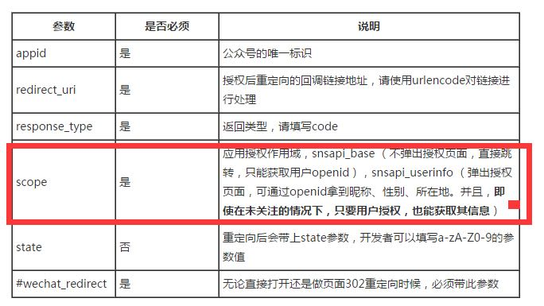

[微信jsapi](https://github.com/zxlie/WeixinApi)

##微信公众号openid

微信公众号的openid是通过公众号**消息**、**自定义菜单**跳转的链接生成的用户`openid`，是微信浏览器里，用户的唯一标示。

除了通过公众号消息、自定义菜单，通过`scope`参数，在不弹出用户认证页面的情况下获取用户`openid'。

例如：

1. 公众号A的用户a，通过公众号消息，在朋友圈转发了活动C页面
2. 用户b在朋友圈打开了C页面，但是此时C页面无法获取b用户的openid，因为b用户并非从消息、菜单来源请求页面
3. 那么只能通过`scope`参数，让用在不弹出认证页面的情况下，获取用户b的唯一openid标示

以上方法，适用于朋友圈转发活动。
